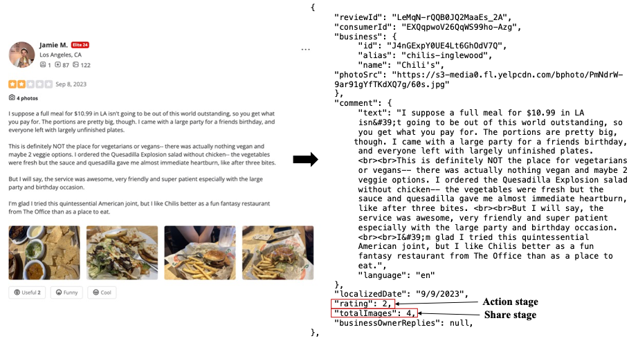
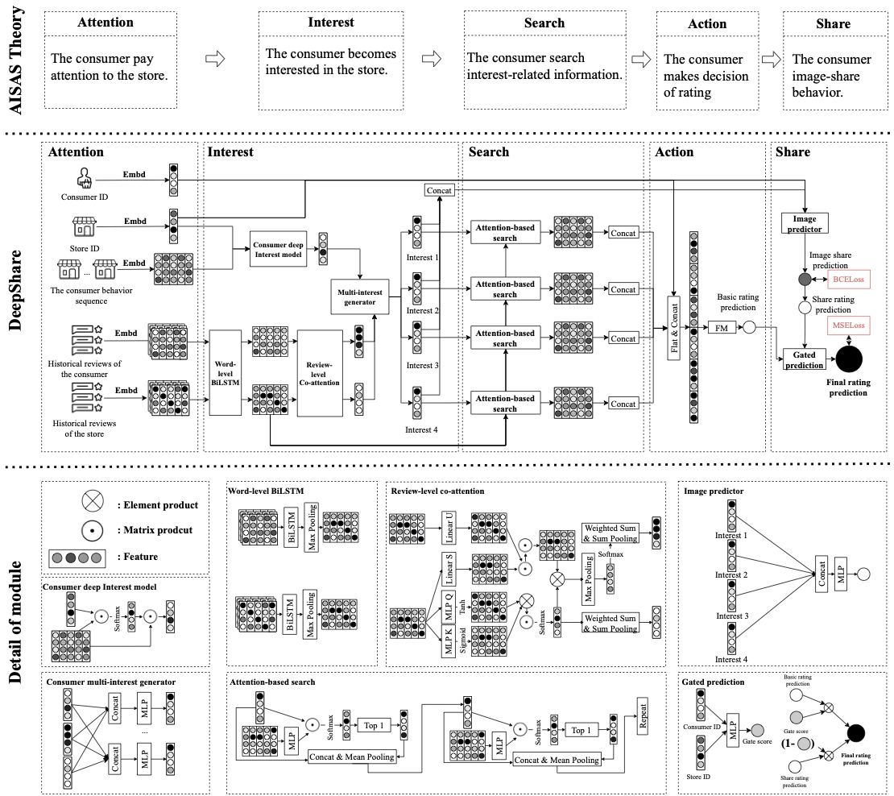

# The review-based rating prediction benchmark

This Benchmark is related to the paper "Understanding the Sequential Nature of Consumer Rating Behavior: A Journey-Based Approach to Rating Prediction", which propose the DeepJourney model.


## Easily get started with
### Install the enviorment:
```
pip install -r requirements.txt
```

### Method treat review as as whole document:
```
cd data;
python pro_doc_data.py;
Train_main.py \
 --which_model RPMIA \
 --batch_size 1024 \
 --model_file ./RPMIA_model/best_model.pt \
 --train_epochs 10 \
 --repeat_expr 1 \
 --train_file ./data/Train.npy \
 --valid_file ./data/Valid.npy \
 --test_file ./data/Test.npy \
 --kernel_count 50 
```

### Method treat review seperate:
```
cd data;
python pro_main_data.py;
python -u Train_main.py \
 --which_model DeepJourney_AISAS \
 --batch_size 1024 \
 --model_file ./DeepJourney_AISAS_model_W_00001/best_model.pt \
 --train_epochs 10 \
 --repeat_expr 1 \
 --train_file ../data/Train_review_deep_journey.npy \
 --valid_file ../data/Valid_review_deep_journey.npy \
 --test_file ../data/Test_review_deep_journey.npy \
 --Loss_weight 0.001
```

## Data
We collect data from Yelp paltform using Yelp Api and [feapder](https://github.com/Boris-code/feapder) framework. You can find at this [link](https://drive.google.com/file/d/10aQUB3u2tvK0-vI5QxrIdw7_lypYfY6n/view?usp=drive_link). Word2vec file can be found at this [link](https://www.kaggle.com/datasets/thanakomsn/glove6b300dtxt)

### Dataset Description

| Dataset  | Yelp  |
|----------|-------|
| **# Consumer** | 10,000  |
| **# Store** | 9,961  |
| **# Review** | 621,440  |
| **# Image-share** | 184,816  |
| **Avg. # review/consumer** | 6.214 (σ = 11.639)  |
| **Avg. # image-share/consumer** | 1.848 (σ = 6.544)  |
| **Density** | 0.623% |

With example:



### Table: Column Descriptions
Note: photo, image,picture are all incicate that the review with image. **And interestingly, we apply advance LLM to analysis the sentiment aspect in each reveiw in the chat_generate column.**


| Column                                 | Meaning                                   |
|----------------------------------------|-------------------------------------------|
| `store_id`                             | Unique identifier for the store           |
| `reviews_id`                           | Unique identifier for the review          |
| `userId`                               | ID of the reviewing user                   |
| `localizedDate`                        | The date of this review               |
| `comment`                              | Textual content of this review            |
| `photos`                               | URL link of photos in this review             |
| `totalPhotos`                          | Total number of photos in the review       |
| `rating`                               | User rating in this review    |
| `shop_rating`                          | Store’s average rating                     |
| `categories`                           | Categories the store belongs to            |
| `review_count`                         | Number of reviews for store                |
| `price`                                | Price range from 1-4 ($ to $$$$) of store    |
| `businessOwnerReplies`                 | Owner replies to this reviews              |
| `location`                             | Store location                             |
| `has_img`                              | Whether the review contains images 1 if yes else 0|
| `txt_len`                              | Length of review text                      |
| `ruzhu_month`                          | Month of the cosnumer between his first review to this reveiw |
| `ruzhu_days`                           | Dats of the cosnumer between his first review to this reveiw |
| `overall_satisfaction`                 | 1 if rating>3 else 0         |
| `if_reply`                             | Whether the business replied to review     |
| `hist_post_img_num`                    | Historical number of images posted by user |
| `store_last_7_days_review_num`         | Number of review received by store in last 7 days   |
| `store_last_7_days_pics_review_num`    | Number of review with image received last 7 days |
| `store_last_7_days_rating_mean`        | Average store rating last 7 days           |
| `cate`                                 | List of Categories the store belongs to       |
| `user_hist_price`                      | Mean of the price of stores this user reviewed|
| `user_hist_cate`                       | List of categories of stores this user reviewed|
| `user_hist_rating`                     | Mean of ratings of stores this user reviewed  |
| `price_differ`                         | Minus between column `price` and `user_hist_price` |
| `rating_differ`                        | Minus between column `rating` and `user_hist_rating` |
| `cate_differ`                          | If all the type in column `categories` in `user_hist_cate` |
| `hist_num`                             | Number of reveiw of this user  |
| `hist_img_num`                         | Number of review with image of this user |
| `user_hist_location`                   | List of zip code of stores this user reviewed |
| `location_differ`                      | If this store `location` in `user_hist_location` |
| `Frrequent_Location_Shift`             | If this store `location` is the most apper location in `user_hist_location`   |
| **`chat_generate`**                    | We apply [LLM](https://huggingface.co/yuyijiong/T5-large-sentiment-analysis-Chinese-MultiTask) to analysis the sentiment aspect of tis review             |
| `food_asp`                             | If food aspect contain in this review 1 or 0  |
| `service_asp`                          | If service aspect contain in this review 1 or 0  |
| `ambience_asp`                         | If ambience aspect contain in this review 1 or 0   |
| `prices_asp`                           | If price aspect contain in this review 1 or 0|
| `general_asp`                          | If other aspect contain in this review 1 or 0 |
| `food_asp_senti`                       | Sentiment on food aspect of negative(0), neutral(1), positive(2)|
| `service_asp_senti`                    | Sentiment on service aspect of negative(0), neutral(1), positive(2)|
| `ambience_asp_senti`                   | Sentiment on ambience aspect of negative(0), neutral(1), positive(2)|
| `prices_asp_senti`                     | Sentiment on price aspect of negative(0), neutral(1), positive(2)|
| `general_asp_senti`                    | Sentiment on other aspect of negative(0), neutral(1), positive(2)|
| `food_senti_avg`                       | Average of sentiment on food aspect of this user|
| `service_senti_avg`                    | Average of sentiment on service aspect of this user|
| `ambience_senti_avg`                   | Average of sentiment on ambience aspect of this user|
| `prices_senti_avg`                     | Average of sentiment on price aspect of this user|
| `general_senti_avg`                    | Average of sentiment on other aspect of this user|
| `food_senti_differ`                    | Minus between column `food_asp_senti` and `food_senti_avg`|
| `service_senti_differ`                 | Minus between column `service_asp_senti` and `service_senti_avg`|
| `ambience_senti_differ`                | Minus between column `ambience_asp_senti` and `ambience_senti_avg`|
| `prices_senti_differ`                  | Minus between column `prices_asp_senti` and `prices_senti_avg`|
| `general_senti_differ`                 | Minus between column `general_asp_senti` and `general_senti_avg`|


## baseline
### Metrods

- **PMF** (@NIPS 2007): Probabilistic Matrix Factorization (PMF), introduced in 2007, learns latent vectors representing users and items from a user-item matrix.

- **FM** (@ICDM 2010): Factorization Machine (FM), proposed in 2010, effectively calculates interactions between variables through factorization.

- **DeepCoNN** (@WSDM 2017): Deep Cooperative Neural Networks (DeepCoNN), introduced in 2016, utilizes convolutional neural networks (CNNs) to extract user and item features from review texts for rating prediction.

- **D-attn** (@RecSys 2017): The Dual Attention-based model (D-attn), proposed in 2017, extends DeepCoNN by incorporating dual local and global attention mechanisms to evaluate user and item preferences for rating prediction.

- **ANR** (@CIKM 2018): Aspect-based Neural Recommender (ANR), introduced in 2018, models user opinions across multiple aspects and item features from reviews to enhance recommendation quality.

- **NARRE** (@WWW 2018): Neural Attentional Rating Regression with Review-Level Explanations (NARRE), proposed in 2018, refines review-based methods by evaluating individual review contributions separately rather than treating reviews as a single aggregated document.

- **AHN** (@AAAI 2020): Asymmetrical Hierarchical Network (AHN), introduced in 2020, is the first model to asymmetrically analyze user interests across diverse item reviews, extending traditional symmetrical approaches.

- **AHAG** (@TKDE 2022): Adaptive Hierarchical Attention-enhanced Gated Network (AHAG), proposed in 2020, employs gated mechanisms to fuse review content and user interactions using hierarchical attention for improved rating prediction.

- **RMCL** (@SIGIR 2023): Review-based Multi-intention Contrastive Learning (RMCL), introduced in 2023, pioneers the analysis of multiple user intentions within reviews using contrastive learning techniques.

- **RRPU** (@EJOR 2024): Review-based Recommendation with Preference Uncertainty (RRPU), proposed in 2024, is the first method to model user preference uncertainty from review information using a probabilistic generative framework.

- **RPMIA** (@IJOC 2025): Rating Prediction Model based on Multi-Interactive Attention (RPMIA), proposed in 2025, uniquely explores aspect-pair interactions between consumers and items for enhanced rating prediction.


### results
We conduct experiment we conducted on a single NVIDIA v100 32G GPU with ubuntu 24 OS.


| Model                | MSE (Mean ± Std.)       | MAE (Mean ± Std.)       |
|----------------------|-------------------------|-------------------------|
| **PMF**              | 4.0491 ± 0.2263         | 1.5310 ± 0.0488         |
| **FM**               | 1.7574 ± 0.0159         | 1.0112 ± 0.0059         |
| **DeepCoNN**         | 1.5960 ± 0.0272         | 0.9985 ± 0.0154         |
| **D-attn**           | 1.4994 ± 0.0280         | 0.9941 ± 0.0217         |
| **ANR**              | 1.5018 ± 0.0436         | 0.9718 ± 0.0200         |
| **NARRE**            | 1.4566 ± 0.0196         | 1.0218 ± 0.0082         |
| **AHN**              | 1.4090 ± 0.0115         | 0.9304 ± 0.0071         |
| **AHAG**             | 1.4944 ± 0.0279         | 0.9683 ± 0.0248         |
| **RMCL**             | 1.4184 ± 0.0157         | 0.9381 ± 0.0121         |
| **RRPU**             | 1.5853 ± 0.0261         | 1.0118 ± 0.0216         |
| **RPMIA**            | 1.5652 ± 0.0070         | 0.9644 ± 0.0053         |
| **DeepJourney-w2v**  | **1.3072 ± 0.0068**     | **0.8946 ± 0.0074**     |
| **DeepJourney-bert** |  1.3781 ± 0.0102        |  0.9165 ± 0.0060        |


## DeepJourney Model
## Model Description

We propose a novel model named **DeepJourney**, which conceptualizes the consumer's decision-making process as a continuous consumption journey, covering the entire cycle from pre-decision, decision, to post-decision behaviors. Specifically, we follow the AISAS (Attention-Interest-Search-Action-Share) theory to model these stages explicitly:

- **Pre-decision behavior**:
  - **Attention Stage**: We model consumer awareness by applying embedding techniques and natural language processing (NLP) models to extract features from textual content.
  - **Interest Stage**: A bidirectional Long Short-Term Memory network (BiLSTM) combined with a co-attention mechanism [@coattention] is employed to capture consumers' explicit and implicit interests.
  - **Search Stage**: We simulate consumers’ search behaviors based on interests identified in previous stages.

- **Decision behavior**:
  - **Action Stage**: We utilize Probabilistic Matrix Factorization (PMF) techniques to capture consumer-store interactions effectively, modeling decision-making actions through rating predictions.

- **Post-decision behavior**:
  - **Share Stage**: A Multi-Layer Perceptron (MLP) is adopted to predict the likelihood of consumers sharing images post-consumption. This prediction further infers the consumer’s satisfaction level post-decision.

Finally, a gated neural network combines the predicted satisfaction from decision (Action) and post-decision (Share) stages to yield the final consumer rating prediction. Feature extraction at the Attention stage employs embedding techniques combined with natural language processing (NLP) models, while Interest extraction uses sophisticated BiLSTM networks enhanced by a co-attention mechanism. The holistic integration across all AISAS stages ensures comprehensive modeling of consumer behavior throughout their consumption journey.


With Framework:
